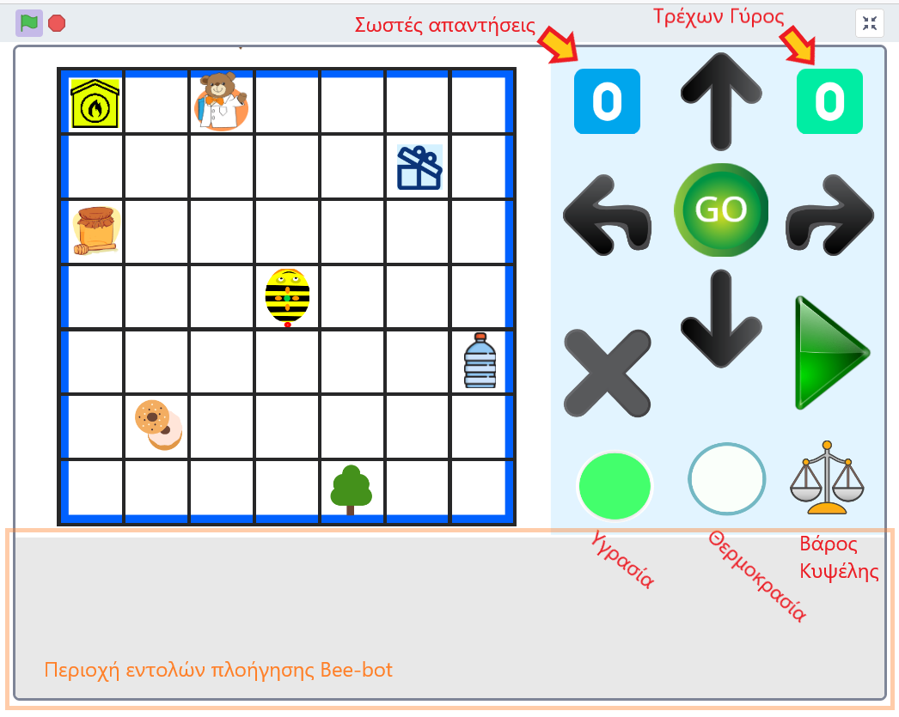
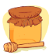
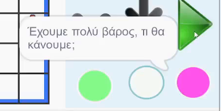
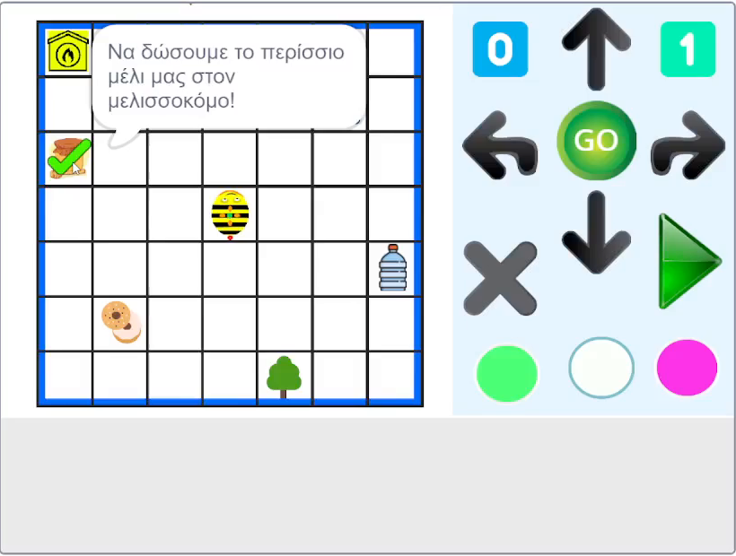
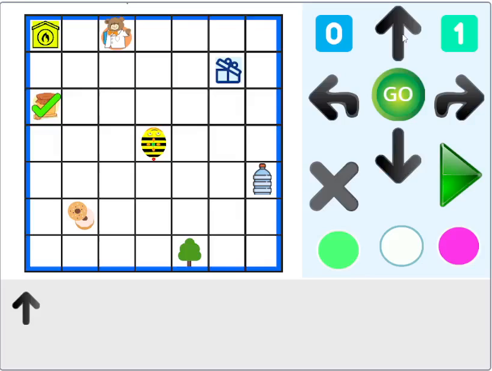
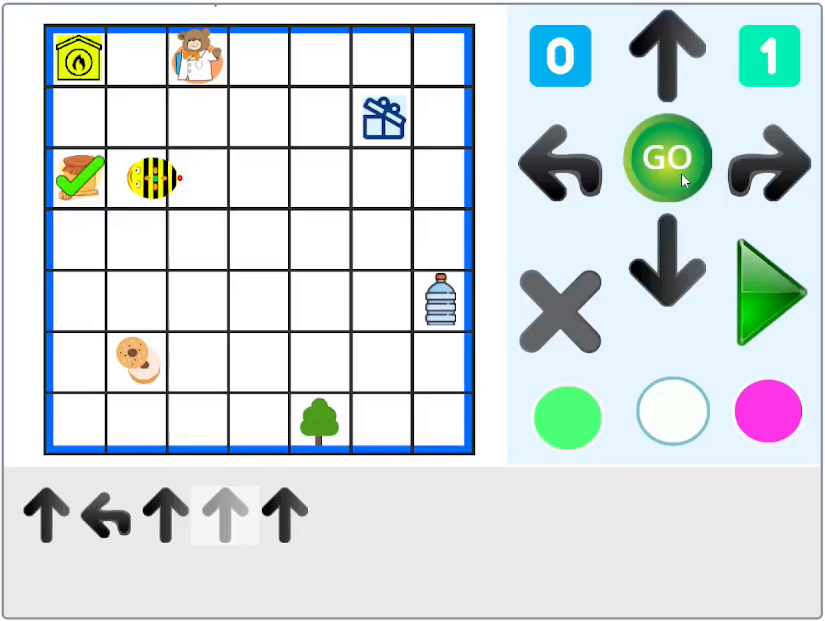
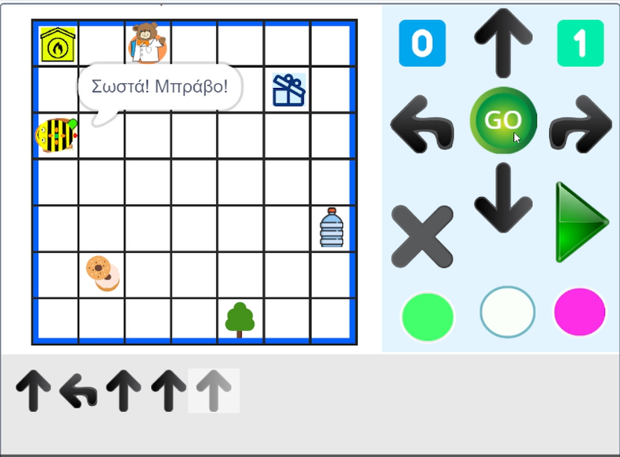
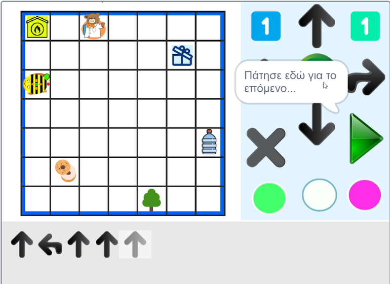

# Παιχνίδι Bee-bot

## Περιγραφή

Το παιχνίδι Bee-bot προσομοιώνει συνολικά τη διαδικασία λειτουργίας και χρήσης ενός Συστήματος Ψηφιακής Μελισσοκομίας που βασίζεται, εκτός των άλλων, στους **Ψηφιακούς Αισθητήρες** και τη **Μηχανική Μάθηση** / **Τεχνητή Νοημοσύνη**  για: 
 - την καταγραφή των συνθηκών που επικρατούν στην κυψέλη, μέσω της μέτρησης **θερμοκρασίας**, **υγρασίας** και του **βάρους** της,
 - την ενεργοποίηση **συναγερμών** (alerts) στην περίπτωση που κάποιες από αυτές τις μετρήσεις ξεπεράσουν κάποια **κατώφλια** (thresholds) καθώς και
 - τις πιθανές **ενέργειες**/**λύσεις** που το σύστημα προτείνει στον μελισσοκόμο ανάλογα με τους συναγερμούς που προκύπτουν.

Κεντρικός χαρακτήρας είναι η Bee-bot η οποία σε κάθε γύρο του παιχνιδιού, με τη βοήθεια των παιδιών, θα πρέπει: 
 - να πάρει τη **σωστή απόφαση** ανάλογα με τις "ακραίες" συνθήκες που επικρατούν κατά περίπτωση και
 -  να πλοηγηθεί με επιτυχία στην **αποστολή** της να φτάσει στη βοήθεια/**λύση** που "θεωρεί" ότι είναι η ενδεδειγμένη!

Το παιχνίδι έχει υλοποιηθεί σε Scratch 3 και ένα στιγμιότυπo της αρχικής οθόνης του είναι το εξής:

Περιλαμβάνει: 
 - το πλέγμα για την προσομοίωση της πλοήγησης της Bee-bot
 - τους μετρητές "Σωστές απαντήσεις" και "Τρέχων Γύρος" του παιχνιδιού
 - τις 4 γνωστές εντολές κίνησης της Bee-bot στο πλέγμα,
 - τους δείκτες των αισθητήρων για την υγρασία, τη θερμοκρασία και το βάρος της κυψέλης, καθώς και
 -  την περιοχή των εντολών του προγράμματος πλοήγησης της Bee-bot πάνω στο πλέγμα.
 
Πάνω στο πλέγμα φαίνονται επίσης, τα εικονίδια των ενεργειών, τις οποίες μπορεί να επιλέξει σε κάθε γύρο η Bee-bot.

### Εντολές κίνησης της Bee-bot

| Εικονίδιο | Κίνηση |  
|--|--|
| |  Μπροστά ένα βήμα (περίπου 15 εκ.)|  
|  |  Πίσω ένα βήμα (περίπου 15 εκ.) |  
|  |  Στροφή δεξιά κατά 90 μ.|
|  | Στροφή αριστερά κατά 90 μ.|

### Αισθητήρες

| Αισθητήρας | Εικονίδιο  | Χαρακτηρισμός | 
|--|--|--|
| Εσωτερική Υγρασία |  | Χαμηλή |
| |  | Κανονική | 
| |  | Υψηλή|  
| Εσωτερική Θερμοκρασία | | Χαμηλή | 
| | | Κανονική|  
| |  | Υψηλή | 
| Βάρος Κυψέλης | | Μικρό | 
|  |  | Κανονικό | 
| |  | Μεγάλο |

### Ενέργειες/Λύσεις

Ακολουθεί η επεξήγηση των εικονιδίων για τις ενέργειες που έχουν υλοποιηθεί, η αντίστοιχη ενέργεια όπως διατυπώθηκε από τα παιδιά καθώς και ο σχολιασμός που έγινε από τον μελισσοκόμο μας.

|Εικονίδιο| Συνθήκες  | Αντίστοιχη Ενέργεια | Μελισσοκόμος |
|--|--|--|--|
|  | Χαμηλή Σχ. Υγρασία | "Να τους δώσουμε νερό" | Η ανάγκη για νερό είναι αυξημένη |
|  | Υψηλή Σχ. Υγρασία | "Να πάνε στον γιατρό"| Όντως μπορεί να φέρει ασθένειες (η υπερβολική υγρασία), όποτε και η ερώτηση στον κτηνίατρο θα ήταν ορθολογική |
|  | Χαμηλή Θερμοκρασία | "Να τις βοηθήσει ο μελισσοκόμος να ζεσταθούνε" | Αν έχει κρύο προσθέτει ειδικά φελιζόλ, κηρόπανα και μικραίνει την είσοδο της κυψέλης. |
|  | Υψηλή Θερμοκρασία| "Να τις πάμε στο δάσος" | Ο μελισσοκόμος [...] μπορεί να τα μεταφέρει σε δροσερό και σκιερό μέρος (π.χ. στο δάσος) |
| | Υψηλή Θερμοκρασία|  "Να ανοίξουμε το καπάκι της κυψέλης (να πάρουνε αέρα)" | Οι μέλισσες φέρνουν κρύο αέρα από την είσοδο της κυψέλης και βγάζουν τον ζεστό από τα παράθυρα στο καπάκι. |
|  | Μικρό βάρος | "Να τους δώσουμε τροφή" | Αν έχει μείωση στο βάρος, όντως μπορούμε να ταΐσουμε το μελίσσι. Μπορούμε να δώσουμε νερό με ζάχαρη ή μελισσοτροφή [...] |
|  | Μεγάλο βάρος | "Να πάρει ο μελισσοκόμος το μέλι" | Αν όντως υπάρχει ώριμο μέλι σε αφθονία μπορεί να το συλλέξει. |

## Γύροι του Παιχνιδιού

Το παιχνίδι περιλαμβάνει 6 γύρους, έναν για κάθε "ακραία" κατάσταση των συνθηκών όπως μετρούνται από τους αισθητήρες.

Κάθε νέος (επόμενος) γύρος του παιχνιδιού ξεκινάει πατώντας το 

**1η Φάση: αλλαγή κατάστασης ενός εκ των αισθητήρων**. Σε κάθε γύρο, ο οποίος ξεκινάει υπό κανονικές συνθήκες και για τους 3 αισθητήρες, ένας από τους μετρητές των αισθητήρων ξεπερνάει ή πέφτει κάτω από τα κατώφλια κανονικότητας, οπότε η κατάσταση του αισθητήρα αλλάζει ανάλογα με την περίπτωση και εμφανίζεται σχετικό μήνυμα που προσομοιώνει την πυροδότηση του αντίστοιχου συναγερμού, όπως φαίνεται στην παρακάτω εικόνα για το "πολύ" μεγάλο βάρος της κυψέλης:

Η σειρά των αλλαγών είναι τυχαία ανά γύρο, αλλά εμφανίζονται συνολικά στο παιχνίδι όλες οι έκτακτες συνθήκες, ακριβώς μία φορά!

**2η Φάση: επιλογή ενέργειας ανάλογα με την έκτακτη κατάσταση**. Στη συνέχεια, τα παιδιά επιλέγουν την ενέργεια που θεωρούν την ενδεδειγμένη στην τρέχουσα, έκτακτη κατάσταση, πατώντας με το ποντίκι πάνω στο εικονίδιό της, στο πλέγμα:

Κατά την επιλογή εμφανίζεται μήνυμα που περιγράφει τη λύση, ενώ η επιλεγμένη ενέργεια, σημειωνεται με το πράσινο "τικ" πάνω στο πλέγμα.

**3η Φάση: πλοήγηση προς την επιλεγμένη λύση**, Το επόμενο βήμα περιλαμβάνει τη δημιουργία του προγράμματος πλοήγησης με τερματισμό την επιλεγμένη λύση, χρησιμοποιώντας το χειριστήριο με τις 4 εντολές της Bee-bot. Στις εικόνες παρακάτω, φαίνεται αυτή η διαδικασία εισαγωγής των εντολών κίνησης της Bee-bot στην Περιοχή Προγράματος:

| Μετά την εισαγωγή της πρώτης εντολής| Μετά την εισαγωγή της τελευταίας εντολής| 
|--|--|
||  |

Όταν τα παιδιά τελειώσουν την εισαγωγή, το πρόγραμμα εκτελείται πατώντας στο "GO" του χειριστηρίου και η Bee-bot αρχίζει να κινείται σύμφωνα με το πρόγραμμα πλοήγησης που της δόθηκε, όπως φαίνεται στο παρακάτω στιγμιότυπο για τον συγκεκριμένο γυρο, όπου η Bee-bot εμφανίζεται να έχει φτάσει σχεδόν στον προορισμό της. ενώ εκτελεί την προτελευταία εντολή που της δόθηκε:

**4η Φάση: Σωστό ή λάθος/Τέλος Γύρου** Όταν η bee-bot φτάνει στον προορισμό της, εξετάζεται η επιλεγμένη ενέργεια και αν όντως αντιμετωπίζει τη συγκεκριμένη έκτακτη κατάσταση:
 - εμφανίζεται το μήνυμα επιβράβευσης για τη σωστή επιλογή και
 - ο μετρητής σωστών αποφάσεων αυξάνεται κατά ένα
όπως φαίνεται στα παρακάτω στιγμιότυπα:

| Μήνυμα επιβράβευσης για τη σωστή επιλογή | Αύξηση κατά ένα του μετρητή σωστών αποφάσεων| 
|--|--|
|||

ενώ σε αντίθετη περίπτωση εμφανίζεται μήνυμα επιβράβευσης της προσπάθειας έστω κι αν η επιλογή ήταν λάθος.
 
**Σημειώνεται ότι** στην 3η Φάση, πριν η Bee-bot φτάσει στον επιλεγμένο προορισμό της, δίνεται στα παιδιά η δυνατόητα 
- να επιλέξουν άλλη ενέργεια και 
- να εκκαθαρίσουν από την περιοχή προγράμματος, το πρόγραμμα πλοήγησης που έχουν εισάγει πατώντας το  είτε το έχουν εκτελέσει είτε όχι και να εισάγουν νέο,

εάν το κρίνουν απαραίτητο, όσες φορές το επιθυμούν.

Από τη στιγμή όμως που η Bee-bot φτάνει στον προορισμό της, μπαίνουμε στην 4η Φάση και ο γύρος τελειώνει.

**Επίσης**, το παιδί έχει ανά πάσα στιγμή τη δυνατότητα να αφήσει τον τρέχοντα γύρο και να περάσει στον επόμενο (αν υπάρχει), πατώντας το 

